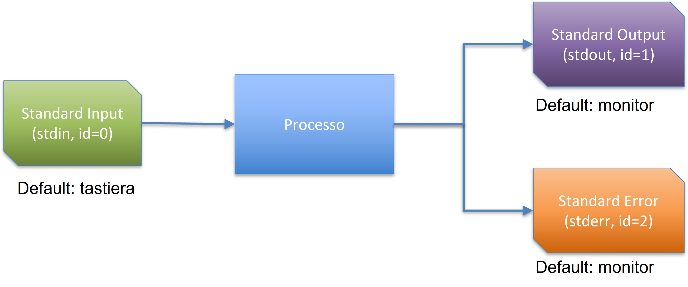
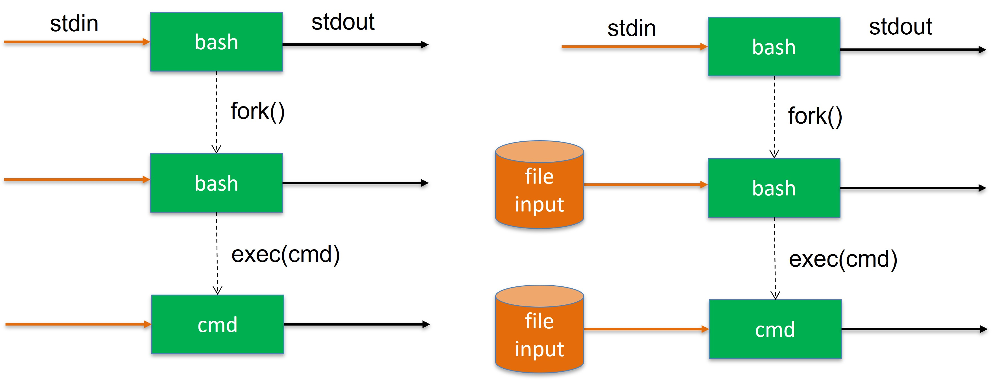
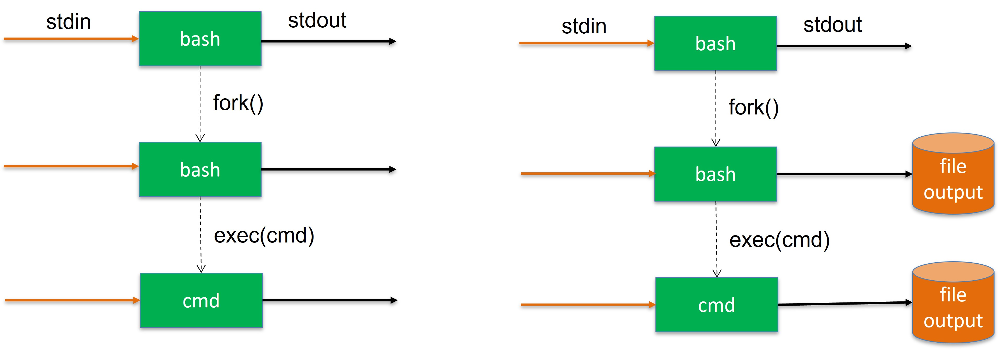
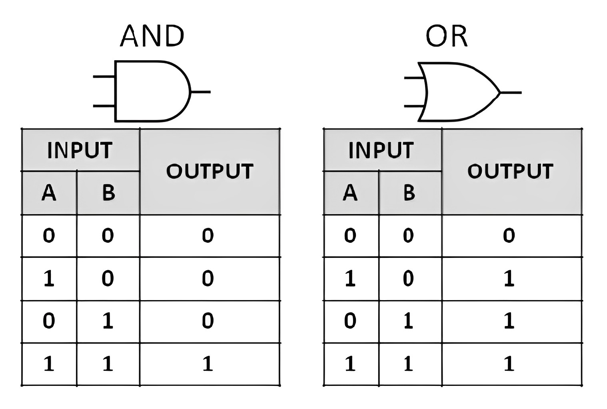
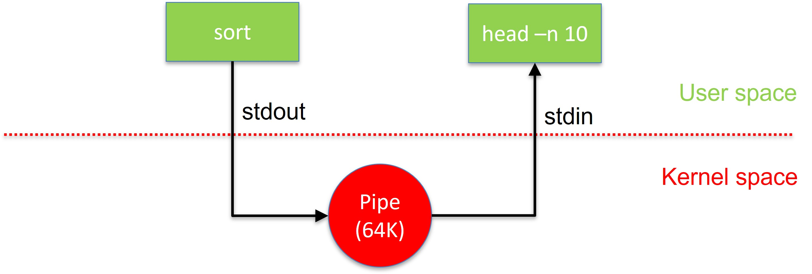

# Utilizzo interattivo
La shell interpreta i comandi degli utenti. Il compito principale di una shell è di fornire un ambiente per l'utente, che può essere configurato usando i file di configurazione delle risorse di shell.

```
$ ls -al .bash*

-rw------- 1 nicola nicola 13932 ago 22 00:39 .bash_history
-rw-r--r-- 1 nicola nicola    21 mag 21 13:56 .bash_logout
-rw-r--r-- 1 nicola nicola    57 mag 21 13:56 .bash_profile
-rw-r--r-- 1 nicola nicola  2721 ago 19 20:59 .bashrc
```

I comandi possono anche essere letti da un file chiamato script shell. Gli script sono interpretati, non compilati. La shell legge i comandi dallo script riga per riga. Esistono molte varianti di shell. Tratteremo la shell bash, nonostante le sue limitazioni rispetto a shell più recenti ed adatte all'utilizzo interattivo come **zsh** e **fish**, per la sua grande diffusione.

## Freccia su, freccia giù, ctrl-r, tab
**Tasti freccia (su e giù)** consentono di spostarsi all'interno della lista dei comandi precedenti (lo stesso elenco mostrato dal comando history)

**ctrl-r** consente di inserire una stringa e selezionare tutti i comandi precedenti che la contengono. Ogni pressione successiva della combinazione **ctrl-r** accede agli altri comandi della stessa selezione

**tab** auto-completa i nomi di file. Una doppia pressione (rapida) mostra l'elenco di tutte le possibilità disponibili

## Comandi esterni
La maggior parte dei comandi impartiti ad una shell sono nomi di altri programmi shell (sperabilmente installati nel sistema) come ad esempio cp, mv, cat etc. Il comando **which** ritorna il percorso assoluto di un comando con un determinato nome.

```shell
$ ls  
$ which ls  
/bin/ls  
$ which which  
/usr/bin/which  
```

## Comandi interni (builtin)
Esistono però particolari comandi, detti **builtin**, che non provengono dall'esecuzione di un file binario ma sono **implementati all'interno della shell**. 

```shell
$ pwd
$ cd  
$ echo
$ read
$ exit
$ true
$ false
$ alias  
$ history    
$ set
$ unset
...
```

Nel loro caso, l'esecuzione di **$ which comando** non ritorna un percorso perchè il file binario non esiste! Ad esempio:

```
$ which pwd
pwd: shell built-in command

```


Vedi lista completa [qui](https://www.gnu.org/software/bash/manual/html_node/Bash-Builtins.html).

### pwd
**pwd** mostra la directory corrente

```shell
$ cd
$ pwd
/home/nicola
```

### cd
**cd** modifica la directory corrente

```shell
$ cd       # home directory
$ cd /tmp  # directory /tmp
```

### echo
**echo** stampa sul terminal quello che gli viene passato come parametro

```shell
$ echo "nicola"
nicola
$ echo $PATH
/home/nicola/bin:/usr/local/bin:/usr/bin:/bin:/usr/local/sbin:...
```

### read
**read** legge una linea da stdin e la inserisce in una variabile. Utile per interazione con utente.

```shell
$ echo "digit exit to quit..."
$ read answer
$ echo "$answer"
```

### exit
**exit** termina l'esecuzione di una shell (e di conseguenza anche di uno script) e ritorna al chiamante un valore [0, 255]

```shell
$ bash     # (avvio sotto-shell)  
$ exit 15  # (terminazione sotto-shell con valore 15)  
$ echo $?  
15  
$
```

### true
**true** comando fittizio. Non fa nulla, e ritorna vero (0)

```shell
$ true; echo $?
0
```

### false
**false** comando fittizio. Non fa nulla, e ritorna falso (1)

```shell
$ false; echo $?
1
```

### alias
**alias** definisce degli alias per i comandi. Nell'esempio sotto viene definito l'alias *ll* per il comando *ls -l*. Utile quando comandi lunghi sono frequentemente utilizzati. **unalias** elimina l'alias.

```shell
$ alias ll='ls -l'
$ ll
total 320
drwx------ 29 nicola nicola  4096 ago 17 23:10 .
drwxr-xr-x  3 root   root    4096 ago  7 10:44 ..
drwxr-xr-x  2 nicola nicola  4096 ago 12 01:14 Desktop
drwxr-xr-x  3 nicola nicola  4096 ago 17 22:58 Devel
drwxr-xr-x  2 nicola nicola  4096 ago  7 10:53 Documents
drwxr-xr-x  6 nicola nicola  4096 ago 16 22:55 Downloads
drwxr-xr-x  2 nicola nicola  4096 ago  7 10:53 Music

$ unalias ll
$ ll
zsh: command not found: ll
```

### history 
**history** permette di visualizzare la cronologia degli ultimi comandi digitati dall'utente. Grazie alla cronologia è possibile ripetere rapidamente un comando già eseguito senza doverlo digitare di nuovo.

```shell
$ history  
1 uname -a  
2 clear  
3 exit   
4 ls  

$ !!  # esegue ultimo comando (in questo caso 4)     
$ !3  # esegue il comando 3    
```

### set
**set** mostra il nome ed il valore di tutte le variabili (locali e d'ambiente) e le funzioni definite all'interno della shell corrente

```shell
$ set
'!'=0
'#'=0
'$'=2204
'*'=(  )
-=0569BJNPXZims
0=zsh
'?'=0
@=(  )
ARGC=0
BROWSER=firefox
BUFFER=''
CDPATH=''
...
```

### unset
**unset** rimuove una variabile (sia locale che d'ambiente) dalla shell corrente

```shell
$ A=1
$ echo $A
1
$ unset A
$ echo $A

```

# Ridirezione
E' possibile ridirigere input e/o output di un comando facendo sì che stdin/stdout/stderr siano sostituiti da file **in modo trasparente al comando**

Ridirezione dell'input  
```
$ comando < filein  
```

Ridirezione dell'output 
```shell
$ comando > fileout   # sovrascrive fileout  
$ comando >> fileout  # aggiunge alla fine di fileout
```  


Ad esempio:

* cat legge da /etc/passwd e stampa il contenuto su stdout  
```shell
$ cat /etc/passwd  
```

* cat legge da stdin, ma il flusso proviene da /etc/passwd  
```shell
$ cat < /etc/passwd
```

* sort legge da stdin, ma il flusso proviene da fin  
* sort scrive su stdout, ma il flusso è ridiretto su fout 
```shell
$ sort < fin > fout
```

* head legge da fin  
* head scrive su stdout, ma il flusso è ridiretto su fout 
```shell
$ head fin > fout
```
 
* tr legge da stdin, ma il flusso proviene da fin
* tr scrive su stdout, ma il flusso è ridiretto su fout
```shell
$ tr [:lower:] [:upper:] < fin > fout
```

* who scrive su stdout, ma il flusso è ridiretto su users (append)
```shell
$ who >> users
```

## Implementazione ridirezione
Ridirezione in input


Ridirezione in output



## Separazione stdout, stderr
Il comando seguente cerca tutte le directory all'interno di /etc. Alcune non sono accessibili ed il comando produce errori insieme agli elementi trovati. Gli errori vengono stampati su **stderr** mentre gli elementi trovati su **stdout**.

```shell
$ find /etc -type d

...
/etc/pacman.d
/etc/pacman.d/gnupg
/etc/pacman.d/gnupg/crls.d
find: ‘/etc/pacman.d/gnupg/crls.d’: Permission denied
/etc/pacman.d/gnupg/private-keys-v1.d
find: ‘/etc/pacman.d/gnupg/private-keys-v1.d’: Permission denied
/etc/pacman.d/gnupg/openpgp-revocs.d
find: ‘/etc/pacman.d/gnupg/openpgp-revocs.d’: Permission denied
/etc/openvpn
/etc/openvpn/client
...
```

E' possibile separare stdout e stderr menzionandoli in modo esplicito in forma numerica (0=stdin, 1=stdout, 2=stderr)

```shell
# scarta stdout, mostra solo gli errori
$ find /etc -type d 1>/dev/null 

find: ‘/etc/cups/ssl’: Permission denied
find: ‘/etc/NetworkManager/system-connections’: Permission denied
find: ‘/etc/audit/plugins.d’: Permission denied
find: ‘/etc/libvirt/secrets’: Permission denied
find: ‘/etc/sudoers.d’: Permission denied
find: ‘/etc/credstore’: Permission denied
...

# scarta stderr, mostra solo elementi trovati
$ find /etc -type d 2>/dev/null 

/etc
/etc/cron.hourly
/etc/xml
/etc/fonts
/etc/fonts/conf.d
/etc/acpi
...

# scarta sia sdtout che stderr, nulla viene mostrato
$ find /etc -type d 1>/dev/null 2>/dev/null 
```

E' inoltre possibile ridirigere un flusso all'interno di un altro flusso. Le due invocazioni seguenti sono sinonimi.

```shell
$ find /etc -type d 1>/dev/null 2>/dev/null 
$ find /etc -type d 1>/dev/null 2>&1
```

In Python è possibile verificare questi comportamenti con lo script seguente che stampa "Hello stdout!\n" su **stdout** ed "Hello stderr!\n" su **stderr**

```python
#!/usr/bin/env python3
import sys  
sys.stdout.write("Hello stdout!\n")
sys.stderr.write("Hello stderr!\n")  
sys.exit(0)  
```

```shell
$ ./test.py 1>/dev/null  
Hello stderr!  
$ ./test.py 2>/dev/null  
Hello stdout!  
```

## File speciali
**/dev/null** è un file speciale che scarta tutto ciò che gli viene scritto sopra. E' il buco nero di ogni sistema Unix.

**/dev/zero** è un file speciale che produce zeri all'infinito quando viene letto.

**/dev/urandom** è un file speciale che produce caratteri casuali all'infinito quando viene letto.

```shell
# premere ctrl-c per interrompere i comandi sotto

# zeri dentro fout
$ cat /dev/zero > fout

# caratteri casuali dentro fout       
$ cat /dev/urandom > fout   

# caratteri casuali dentro il nulla
$ cat /dev/urandom > /dev/null  
```

Per controllare le dimensioni lette/scritte utilizzare il comando **dd**.

```shell
# 1 blocco di 1K da /dev/zero verso fout
dd if=/dev/zero bs=1K count=1 of=fout

# 1 blocco di 1K da /dev/urandom verso fout
dd if=/dev/urandom bs=1K count=1 of=fout

# 1000 blocchi di 1M da /dev/zero verso /dev/null
dd if=/dev/urandom bs=1M count=1000 of=fout
```

# Combinazione di comandi

## Concatenazione semplice
**cmd1; cmd2**  

Esegue cmd2 a prescindere dal valore di ritorno di cmd1. 

```shell
$ true; ls  
Desktop  Devel  Documents  Downloads...

$ false; ls  
Desktop  Devel  Documents  Downloads...

$ true; echo $?  
0

$ false; echo $?
1
```

In shell, 0 è interpretato come successo (vero), > 0 come fallimento (falso).

## AND logico
**cmd1 && cmd2**  

Esegue cmd2 solo se cmd1 termina con successo (ritorna 0)  

```shell
$ true && ls
Desktop  Devel  Documents  Downloads...

$ false && ls
```

## OR logico
**cmd1 || cmd2**  
Esegue cmd2 solo se il primo fallisce (ritorna 1)  

```shell
$ true || ls  
$ false || ls
Desktop  Devel  Documents  Downloads...
```



## Pipes 
La seguente scrittura è formalmente corretta ma poco efficiente. L'output del primo comando viene scritto su disco solo per essere letto dal secondo comando.

```shell
$ find /etc -type d 2>/dev/null > fout; grep pacman fout
```

Approccio estremamente inefficiente. La memoria secondaria (SSD) è molto meno performante della memoria primaria (RAM):
* SDD: ~ 0.5 GB/s
* DDR5: ~ 50 GB/s

L'output di un comando può esser diretto a diventare l'input di un altro comando (usando il costrutto pipe '|'). Pipe come costrutto parallelo: l'output del primo comando viene reso disponibile al secondo e consumato appena possibile, in assenza di file temporanei.

La comunicazione fra i due processi non è diretta ma è mediata dal kernel.

```shell
# ordina /etc/passwd e mostra le prime 10 linee
$ sort /etc/passwd | head -n 10 
```



Esempi:
```shell
# ordina /etc/passwd e mostra le ultime 5 linee
$ sort /etc/passwd | tail -n 5  

# ordina /etc/passwd e mostra le penultime 5 linee
$ sort /etc/passwd | tail -n 10 | head -n 5 

# legge caratteri casuali da /dev/urandom e li conta 
$ cat /dev/urandom | wc -c (osservare con top)

# legge /etc/passwd, lo ordina e mostra le prime 10 linee
$ cat /etc/passwd | sort | head

# conta gli utenti collegati al sistema
$ who | wc -l

# Stampa il contenuto della cartella corrente, seleziona le righe che iniziano per d (directory) ed ordina il risultato
$ ls -l | grep ^d | sort 

# mostra shell usate nel sistema senza ripetizioni
$ cat /etc/passwd | cut -d ":" -f 7 | uniq -u  

# mostra penultimi 5 utenti in ordine alfabetico
$ sort /etc/passwd | tail -n 10 | head -n 5  
```

# Variabili
E' possibile definire variabili (trattate come stringhe) ed assegnare loro un valore con l'operatore **=**  

```shell
$ VAR=3
```

Si accede ai valori delle variabili con il carattere speciale **\$**  

```shell
$ echo $VAR  
3
```

Un esempio con 2 variabili:
```shell
$ A=1; B=nicola  
$ echo $A  
1  
$ echo $B  
nicola  
```

La visibilità delle variabili definite all'interno di una shell è limitata alla shell stessa. **Eventuali sotto-shell non ereditano le variabili.**

```shell
$ A=1  
$ echo $A  
1  
$ bash (sotto-shell)  
$ echo $A 

$
``` 
 
 ## Variabili d'ambiente
Per espandere la vita delle variabili anche alle sotto shell si utilizzano particolari variabili chiamate **variabili d'ambiente.**

Ogni processo esegue nell'ambiente associato al processo che l'ha messo in esecuzione. Di conseguenza, ogni shell eredita l'ambiente dalla shell che l'ha messa in esecuzione.

La prima shell ad eseguire dopo il login o dopo l'apertura di un terminale grafico, legge un file (es. .bash_profile/.bashrc) che contiene fra le altre cose variabili di configurazione che vengono così prorogate a tutte le shell successive (figlie).  

E' possibile aggiungere variabili all'ambiente utilizzando il comando **export**. Le variabili esportate si comportano come variabili locali ma sono visibili anche dalle sotto-shell.

```shell
$ export A=1  
$ echo $A  
1  
$ bash (sotto-shell)  
$ echo $A  
1  
$
```

## env
**env** mostra l'elenco delle variabili d'ambiente della shell corrente.

```shell
$ env  
SHELL=/bin/bash  
TERM=xterm-256color  
USER=nicola  
HOME=/home/nicola  
LOGNAME=nicola  
PATH=/usr/local/sbin:/usr/local/bin:/usr/sbin:/usr/bin:/sbin:/bin:/usr/games:/usr/local/games:/snap/bin
...
```

**set (builtin)** mostra il nome ed il valore di tutte le variabili (locali e d'ambiente) e le funzioni definite all'interno della shell corrente

```shell
$ set
'!'=0
'#'=0
'$'=2204
'*'=(  )
-=0569BJNPXZims
0=zsh
'?'=0
@=(  )
ARGC=0
BROWSER=firefox
BUFFER=''
CDPATH=''
...
```

## Variabili d'ambiente rilevanti
```shell
PATH=/home/nicola/bin:/usr/local/bin:/usr/bin:/bin:...
HOME=/home/nicola
EDITOR=micro
SHELL=/bin/bash
PWD=/home/nicola
```

# Espansioni

## Metacaratteri 
La shell riconosce caratteri speciali (wild cards)

\* = una qualunque stringa di zero o più caratteri in un nome di file
```
$ ls D*
Desktop:

Devel:
operatingsystemsbsc

Documents:

Downloads:
```  

? = un qualunque carattere in un nome di file  
```
$ ls ?ideos

Videos:
```

[abc] = un qualunque carattere, in un nome di file compreso tra quelli nell'insieme. Anche range di valori: [a-g]
```
$ ls -l /etc/[mnop]asswd
-rw-r--r-- 1 root root 2084 ago 16 13:49 /etc/passwd
```

\\ segnala di non intrerpretare il carattere successivo come speciale
```
$ echo *    
Desktop Devel Documents Downloads Music Pictures Public Templates Videos

$ echo \*
*
```

Ad esempio:
```shell
# Elenca i file i cui nomi iniziano con il carattere .
$ ls .*  

# Elenca i file i cui nomi hanno come iniziale un carattere compreso tra 'a' e 'c' oppure tra '1' e '3', e il cui penultimo carattere sia 'c' o 'f'
$ ls [a-c,1-3]*[c,f]?

# Elenca i file in cui nomi contengono, in qualunque posizione, il carattere *
$ ls *\** 
```

## Esecuzione in-line
E' possibile eseguire un comando ed utilizzarne l'output all'interno di un altro comando attraverso la sintassi **$( cmd )**

```shell
$ echo $(pwd)  
/home/nicola  
$ echo $(expr 2 + 3)  
5
```

## Inibizione
Ogni volta che utilizziamo un comando che contiene variabili, metacaratteri o esecuzioni inline, la shell espande in loro contenuto nell'ordine che segue:

1. **$( )** sono eseguiti e sostituiti con il risultato prodotto  
2. Variabili sono espanse nei valori corrispondenti 
3. Metacaratteri sono espansi nei nomi di file corrispondendi

In alcuni casi è necessario inibire queste espansioni: 
* ' ' (singoli apici): evita ogni espansione nella stringa contenuta  
* " " (doppi apici): evita espansione dei soli metacaratteri nella stringa contenuta

Ad esempio:
```shell
# rimuove i file che cominciano con $var 
$ rm '$var'*  

# rimuove i file che cominciano con il contenuto della variabile var 
$ rm "$var"*

# stampa il nome della directory corrente
$ echo "$(pwd)"

# stampa $(pwd)
$ echo '$(pwd)'

# stampa eventuali nomi di file che iniziano per D o E, seguiti da own e qualsiasi altro carattere
$ echo [D-E]own*
Downloads

# stampa [D-E]own*
$ echo "[D-E]own*"
[D-E]own*
```


