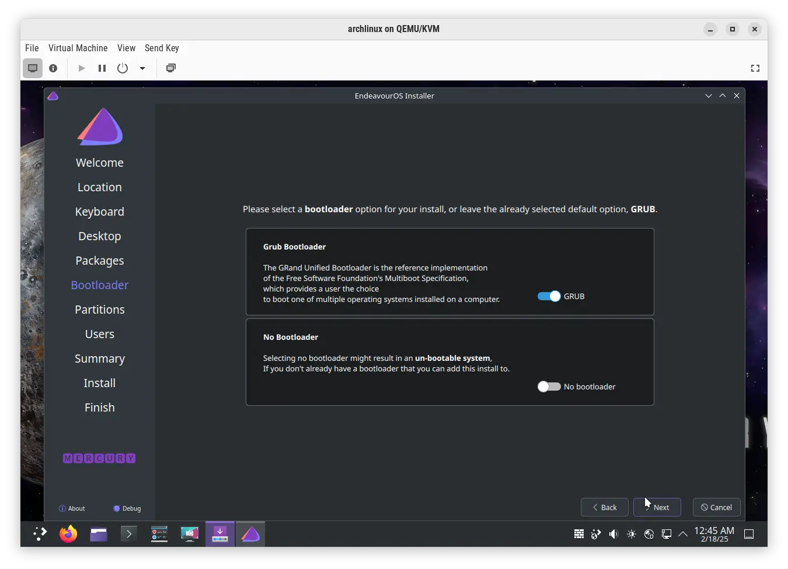

# EndeavourOS installation guide

Select: **Start the installer**

Select: **Online**

Select: **Cinnamon**

Leave defaults

Leave defaults

Select: **Erase disk -> Swap to file**

Insert: **Username and password**