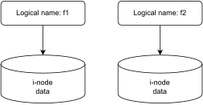
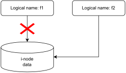
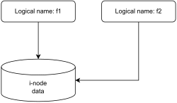

# Introduzione a Unix

## Total Market Share


## Mobile Market Share


## Unix
Si tratta di un sistema operativo multiutente e multitasking che fornisce una piattaforma stabile, efficiente e flessibile per varie attività di elaborazione. È stato sviluppato nel 1969 presso i Bell Labs da Ken Thompson e Dennis Ritchie. Nel corso degli anni, Unix si è evoluto e sono state create molte varianti, tra cui Linux, Android, MacOS, IoS. Storia completa [qui](https://en.wikipedia.org/wiki/History_of_Unix).

Il sistema operativo Unix può essere riassunto in base alle seguenti caratteristiche:
* **Multiutente**: più utenti possono interagire contemporaneamente (da terminali diversi) con il sistema, che evita interferenze tra le attività dei vari utenti;
* **Multitasking**: il suo nucleo o kernel può supportare la contemporanea esecuzione di più processi gestiti a divisione di tempo (timesharing);
* **Gestione della memoria virtuale**: il sistema di gestione della memoria virtuale in Unix si basa su paginazione e segmentazione. Queste caratteristiche consentono ad ogni processo di indirizzare un'area di memoria di dimensioni eventualmente superiori a quelle della memoria centrale effettivamente disponibile;
* **Portabile**: grazie all'impiego del linguaggio C nella realizzazione del sistema, esso gode di un'elevata portabilità, ed è oggi disponibile su una vasta gamma di architetture hardware di processori;
* **Aperto**: soprattutto nelle versioni più recenti le caratteristiche di Unix si sono via via uniformate allo standard POSIX. Inoltre, Unix realizza alcuni dei più diffusi servizi e protocolli di comunicazione della rete Internet.

## Varianti Unix


## Varianti Linux

Le distribuzioni linux (unione di kernel, utilità di sistema e pacchetti applicativi) sono centinaia. La maggior parte di quelle utilizzate oggi derivano da una delle famiglie seguenti:
* Debian/Ubuntu (apt)
* RedHat (rpm)
* **Arch (pacman)** 
* Gentoo (portage) 

Vedi [tassonomia completa](https://en.wikipedia.org/wiki/List_of_Linux_distributions) delle distribuzioni linux.


## KISS principle
* **Keep It Simple, Stupid**
* In riferimento al codice sorgente di un programma, **significa mantenere uno stile di progettazione semplice e lineare** demandando le ottimizzazioni al compilatore o a successive fasi dello sviluppo
* In ambito UNIX, tanti semplici strumenti in grado di funzionare in modo orchestrato piuttosto che una sola struttura monolitica
* Richiama in parte il principio filosofico del Rasoio di Occam: a parità di fattori la soluzione più semplice è da preferire.
* (https://en.wikipedia.org/Wiki/Unix-philosophy)

## Architettetura sistema operativo

Quattro livelli fondamentali:

* **Hardware**: la macchina fisica, ovvero la base del sistema, che è costituita dalla memoria (RAM), dal processore (o CPU), dai dispositivi di input/output (I/O) quali storage e reti, e dalle funzioni di elaborazione grafica. La CPU esegue i calcoli e le attività di lettura e scrittura sulla memoria.
* **Kernel**: il nucleo del sistema operativo. Si trova esattamente nel mezzo. È il software che risiede in memoria e che indica alla CPU cosa fare.
* **Sistema di base**: si tratta di una gruppo di programmi e librerie necessari all'utilizzo del sistema. Il solo kernel sarebbe inutilizzabile.
* **Processi utente**: si tratta dei programmi in esecuzione, gestiti dal kernel. Collettivamente, costituiscono lo spazio utente e sono noti anche solo come processi. Il kernel consente anche la comunicazione tra questi processi e server, un'attività nota come comunicazione tra processi o IPC.


## Kernel
Il kernel è il componente principale di un sistema operativo e l'interfaccia primaria tra l'hardware di un sistema e i suoi processi, ai quali consente di comunicare gestendo le risorse nel modo più efficiente possibile.

Il kernel (in italiano "nocciolo") si chiama così perché, come un seme nel guscio, è situato all'interno del sistema operativo e controlla tutte le principali funzioni dell'hardware, che sia un telefono, un laptop, un server o qualsiasi altro tipo di computer.

## Funzionalità principali del kernel
Il kernel svolge quattro funzioni principali:

* **Gestione della memoria**: tiene traccia della quantità di memoria utilizzata per lo storage dei dati e della loro posizione
* **Gestione dei processi**: stabilisce quali processi possono utilizzare la CPU e per quanto tempo
* **Gestione dei dispositivi**: funge da elemento di mediazione tra l'hardware e i processi

Se implementato in maniera corretta, il kernel opera autonomamente all'interno del suo spazio, nel quale alloca la memoria e tiene traccia di ogni elemento archiviato, risultando invisibile all'utente. Ciò che è visibile all'utente, ovvero i browser web, i file, etc è noto come spazio utente. Queste applicazioni interagiscono con il kernel mediante un'interfaccia per le chiamate di sistema (*system calls*).

Il codice dei programmi viene eseguito sulle CPU in modalità kernel o in modalità utente. Il codice eseguito con la modalità kernel ha accesso illimitato all'hardware, mentre la modalità utente limita l'accesso di CPU e memoria. 


## Quanto è complesso un kernel
* 20K SLOC (XV6), https://github.com/mit-pdos/xv6-public
* 30M SLOC (Linux Kernel 5), https://www.kernel.org/


# Fondamenti per l'utilizzo pratico

## Terminale
Con il termine **console** o **terminale** si definisce una coppia tastiera/video collegata alla macchina. Storicamente, per rendere accessibile una macchina da più utenti, era possibile collegare più tastiere e video allo stesso computer. Oggi i terminali sono virtuali (programmi che simulano una coppia tastiera/mouse monitor).

Caratteristiche:
* Accesso completo alla configurazione del sistema e dei servizi
* Automatizzazione e scripting
* Basso consumo di risorse computazionali
* Esistono applicazioni in cui un terminale grafico non viene installato perchè inutile (non esiste monitor) o per risparmiare risorse (apparati rete/applicazioni IoT)

Per chiudere un terminale:
* exit
* logout
* ^d


## Ambiente grafico
Caratteristiche:
* Semplicità di utilizzo
* Maggiore consumo di risorse computazionali

Nella maggiorparte dei sistemi Unix, l'ambiente grafico è slegato dal resto del sistema e può essere sostituito (anche dopo l'installazione del sistema). Ne esistono [decine](https://opensource.com/article/20/5/linux-desktops), i principali sono elencati sotto:

* GNOME (gtk)
* Cinnamon (gtk)
* Budgie (gtk)
* Xfce (gtk)
* KDE (qt)
* awesome
* hyprland

[unixporn](https://www.reddit.com/r/unixporn/) è un canale Reddit dedicato alla condivisione di configurazioni di ambienti grafici Unix. Alcuni esempi sotto: 


## Shell
Programma che permette di far interagire l'utente con il sistema operativo tramite comandi inseriti in modo interattivo da tastiera oppure letti in modo automatico da file (script). Gli script shell sono la base della maggior parte degli automatismi nei sistemi Unix.

**La shell non é unica**, un sistema può metterne a disposizione varie:  
* Bash (/bin/bash)
* Zsh (/bin/zsh)
* Fish (/bin/fish)  

## Editor di testo
Un editor di testo è un programma per la composizione di testi. Un semplice editor è generalmente incluso in ogni sistema operativo. 
Poiché la scrittura di un testo è pratica comune a molte attività legate alla gestione o all'uso di un sistema operativo, esistono editor di ogni sorta, dai più semplici ai più complessi e raffinati:
* micro/nano/mcedit
* vi/vim/nvim
* VSCode (solo in ambiente grafico)

## Manuale
Esiste un manuale (man), consultabile per informazioni su ogni comando Linux. Per ogni comando, il manuale indica:  
  * formato del comando (input) e risultato atteso (output)  
  * descrizione delle opzioni  
  * possibili restrizioni  
  * file di sistema interessati dal comando  
  * comandi correlati  
  * eventuali bug per uscire dal manuale  

Comandi base per il manuale:
* per cercare una stringa: **/**
* per uscire: **q**

```
# apre la pagina di manuale del comando ls
$ man ls
```

Per semplificare le cose, esiste una convenzione per regolare l'invocazione dei comandi: **nome comando** *opzioni* argomenti

```
$ ls -al /
```

* se un'opzione o un argomento possono essere omessi, si indicano tra quadre [opzione]
* quando un argomento può essere ripetuto n volte, si aggiungono dei puntini argomento...
* se due opzioni/argomenti sono mutuamente esclusivi, vengono separati da |. Ad esempio: arg1 | arg2  

```
$ ls --help
Usage: ls [OPTION]... [FILE]...
...
```

Infine, come mostrato sopra, la maggior parte dei comandi mostra un breve sommario delle opzioni disponibili quando invocata con l'opzione *--help*

## Gestione pacchetti

### pacman (arch)
```
# aggiorna la lista dei pacchetti disponibili
$ sudo pacman -Syy  

# cerca pacchetti in base a parole chiave
$ yay nome_pacchetto

# installa un pacchetto e le sue dipendenze
$ sudo pacman -S nome_pacchetto 

# rimuove un pacchetto
$ sudo pacman -R nome_pacchetto  

# rimuove pacchetti inutili (dipendenze di pacchetti già rimossi in precedenza)
$ sudo pacman -Qtdq | pacman -Rns -

# rimuove tutti i pacchetti scaricati
$ sudo pacman -Sc 

# aggiorna intera distribuzione
$ sudo pacman -Syyu
```

### apt (debian)
```
# aggiorna la lista dei pacchetti disponibili
$ sudo apt update  

# cerca pacchetti in base a parole chiave
$ sudo apt search nome_pacchetto

# installa un pacchetto e le sue dipendenze
$ sudo apt install nome_pacchetto 

# rimuove un pacchetto
$ sudo apt remove nome_pacchetto  

# rimuove pacchetti inutili (dipendenze di pacchetti già rimossi in precedenza)
$ sudo apt autoremove

# rimuove tutti i pacchetti scaricati
$ sudo apt clean  

# aggiorna intera distribuzione
$ sudo apt dist-upgrade
```

# Utenti e gruppi

## Multiutenza e multitasking
Un sistema operativo **multitasking** permette di eseguire più programmi (task) contemporaneamente. Ad esempio, se viene chiesto al sistema di eseguire due processi, A e B, la CPU eseguirà per qualche istante (10-20ms) il processo A, poi il processo B, e così via. Il componente del kernel delegato a questa funzione viene chiamato **scheduler**.

Un sistema operativo **multiutente** può essere utilizzato da più utenti. Ad ogni utente del sistema viene assegnato:
* uno username/userid (/etc/passwd)
* una password (/etc/shadow)
* uno o giù gruppi di appartenza (/etc/group)
* una cartella personale (/home/utente).

Esiste un utente privilegiato, il cui username è **root**, che viene assegnato all'amministratore del sistema. **root** può modificare la configurazione dell'intero sistema. Quando si inizia una sessione di lavoro si *entra* nel sistema tramite nome utente e relativa password.

```
Password: ******
Last login: Fri Mar 06 10:27:08 on tty2

$ _
```

## /etc/passwd
**Username**: username dell'utente  
**Password**: la x indica che la password cifrata è presente nel file /etc/shadow  
**User ID (UID)**: ID utente  
**Group ID (GID)**: ID del gruppo (primario) dell'utente  
**User ID Info**: Informazioni aggiuntive  
**Home directory**: percorso assoluto home directory utente  
**Shell**: percorso assoluto shell utente  

```
$ cat /etc/passwd

root:x:0:0::/root:/bin/zsh
bin:x:1:1::/:/usr/bin/nologin
daemon:x:2:2::/:/usr/bin/nologin
...
usbmux:x:140:140:usbmux user:/:/usr/bin/nologin
nicola:x:1000:1000:Nicola Bicocchi:/home/nicola:/bin/zsh
```

## /etc/shadow
```
$ sudo cat /etc/shadow

root:$6$uWHwIUSzGaxw/3hw$awb8CUBdLboSNDfPBckGpHrZg5Fi3YmMJCAYtzBZ1d/yn7c69kIPfq48UAspkSRsGl4OnOPHh8es1PIA6Rpa6.:19576::::::
bin:!*:19576::::::
daemon:!*:19576::::::
...
usbmux:!*:19576::::::
nicola:$6$fgSYXa7ydO/y9g2z$qyV/JOWdzULc72Co02ZBCFFSiReixWN9M60iZ0H7.lvqC/ZfJ.ZdjM1v0KtJEaynnvL7PhI.Cnsct6xuMPk/C.:19576:0:99999:7:::
```

## /etc/group
**Group name**: nome del gruppo  
**Password**: generalmente non utilizzato. Si possono definire password di gruppo  
**Group ID (GID)**: ID del gruppo  
**Group List**: lista degli utenti che appartengono al gruppo  

```
$ cat /etc/group

root:x:0:root
sys:x:3:bin,nicola
mem:x:8:
...
usbmux:x:140:
nicola:x:1000:
```

## who, whoami, id
**who** mostra gli utenti attivi nel sistema

```
$ who  
nicola   tty7         2023-08-23 21:35 (:0) 
```

**whoami** mostra il nome dell'utente corrente  

```
$ whoami  
nicola  
```

**id** mostra UID, GID, gruppi secondari  

```
$ id  
uid=1000(nicola) gid=1000(nicola) groups=1000(nicola),3(sys),982(rfkill),998(wheel)
```

## passwd
Il comando **passwd** imposta e modifica le password per gli utenti. Utilizzare questo comando per modificare la propria password (tutti gli utenti) o quella di un altro utente (solo admin). 

Per modificare la propria password il comando passwd richiede all'utente la vecchia password e quindi la nuova password due volte. Se le due voci della nuova password non corrispondono, richiede nuovamente la nuova password.

```
$ passwd  
(current) UNIX password:  
Enter new UNIX password:  
Retype new UNIX password:  
```

## sudo
**sudo** eleva i diritti di esecuzione (da utente a root) per un solo comando. In questo esempio, l'aggiornamento del sistema richiede i diritti di amministrazione.
```
$ sudo apt-get update  
$ <-- Prompt utente normale  
```

**sudo -i** eleva i diritti di esecuzione (da utente a root) per una nuova shell.
```
$ sudo -i  
# <-- Prompt utente root  
```

Eleva i diritti di esecuzione in modo permanente.

## useradd, userdel
In caso non si voglia modificare manualmente i file /etc/passwd e /etc/group e /etc/shadow, è possibile utilizzare i comandi **useradd** e **userdel** per aggiungere e rimuovere utenti dal sistema.

```
# aggiunge un nuovo utente 
$ sudo useradd username 
 
# rimuove un utente 
$ sudo userdel username  
```

# Filesystem

## Tutto è file
File come risorsa logica costituita da sequenza di bit, a cui viene dato un nome. Astrazione che consente di trattare allo stesso modo entità fisicamente diverse come file, directory, link, dispositivi di storage, tastiera, video etc. Esistono tre tipi di file:
* **ordinari**: archivi di dati, comandi, programmi sorgente  
* **directory**: contengono riferimenti a file  
* **speciali**: dispositivi hardware, soft links, FIFO, etc

I file ordinari si dividono in:
* **file di testo**: leggibile da un essere umano. I dati contenuti rappresentano caratteri (ASCII o Unicode)  
* **file binarii**: richiede specifica interpretazione di un software per essere letto (mp3, avif, mp4)  

Si definisce **estensione** il gruppo di 2-4 caratteri terminali del nome di un file che alcuni sistemi, ad esempio Windows utilizzano per rappresentare il tipo del file (ad es. img.avif, song.mp3 etc). I sistemi Unix analizzano invece il contenuto del file per determinarne il tipo. 

```
$ file /etc/passwd                                              
/etc/passwd: ASCII text

$ file /bin/ls    
/bin/ls: ELF 64-bit LSB pie executable, x86-64, version 1 (SYSV)...
```

## Struttura file system
Ogni sotto-directory di / raggruppa file con uno scopo preciso. Può variare leggermente fra diversi sistemi, ma in generale:  
* **/bin** binari di sistema
* **/dev** file speciali (che rappresentano dispositivi)
* **/etc** file di configurazione  
* **/home** home degli utenti  
* **/lib** librerie
* **/proc** interfaccia (human-readable) verso il kernel  
* **/sbin** binari di sistema
* **/tmp** file temporanei  
* **/usr** binari di applicativi 
* **/var** log di sistema


## mount e umount
Un file system (contenuto su qualsiasi dispositivo, ad esempio una chiavetta usb) per essere utilizzato deve essere montato su un file system esistente, usando una directory come punto di attacco. La directory di aggancio prende il nome di mount point.

Un file system può essere accoppiato a un mount point tramite l'operazione di **mount**. Un file system può essere disaccoppiato dal suo mount point tramite l'operazione di **umount** (inversa di **mount**).

Per motivi di efficienza, le scritture su di un file system sono eseguite in blocco, al momento più favorevole. Estrarre fisicamente un dispositivo senza aver smontato il suo file system può portare corruzione dei dati!


## Percorsi assoluti e relativi
Ogni file può essere identificato da:  
* 1 **percorso assoluto**: riferito alla radice della gerarchia. Inizia SEMPRE con /  
```
# /etc/passwd osservato dalla radice /
$ cat /etc/passwd
```
* n **percorso relativi**: riferiti alla posizione dell'utente nel file system (n=numero di directory nell'intero filesystem).  
```
# /etc/passwd osservato da /home/nicola
$ cat ../../etc/passwd
```

Nomi speciali:  
* **.** direttorio corrente 
* **..** direttorio genitore (su di 1 livello)  
* **~** home dell'utente (ad es. /home/nicola)  

## Protezione dei file
Multiutenza implica necessità di regolare gli accessi alle informazioni. Ogni file è marcato con UID e GID del proprietario.

Per ogni file, esistono 3 tipi di utilizzatori:  
* **proprietario** (o=owner)
* **gruppo del proprietario** (g=group)  
* **tutti gli altri utenti** (a=all)

Per ogni utilizzatore, si distinguono tre diritti di accesso al file:  
* **lettura** (r=read)  
* **scrittura** (w=write) 
* **esecuzione** (x=execute) (per una directory significa list del contenuto)  


Per ogni terna, per ogni bit di protezione: 1 = *attivato*, 0 = *disattivato*. Nell'esempio seguente, il proprietario del file ha tutti i diritti attivati, mentre gli utenti del suo gruppo, e tutti gli altri utenti possono solo leggere il file.


## SUID, SGID, Sticky
**SUID (Set User ID)**: si applica ad un file di programma eseguibile. Se attivo, l'utente che esegue assume i diritti del proprietario (per la durata dell'esecuzione).

**SGID (Set Group ID)**: si applica ad un file di programma eseguibile. Se attivo, l'utente che esegue assume i diritti del gruppo proprietario (per la durata dell'esecuzione).

**STICKY**: il sistema cerca di mantenere in memoria l'immagine del programma, anche se non è in esecuzione  

L'esempio seguente mostra una **s** al posto della **x** sulla terna di sinistra. Il processo acquisirà i diritti del proprietario del file (root) e NON dell'utente che lo lancia (implicazioni di sicurezza).
```
$ ls -al /usr/bin/passwd
-rwsr-xr-x 1 root root 51552 gen 25  2023 /usr/bin/passwd
```

## chmod, chown
```
# sposta la directory corrente all'interno della home directory
$ cd

# crea un file vuoto
$ touch test.txt 
```

```
# assegna nuovi diritti 
$ chmod 0755 test.txt  
```

```
# assegna proprietario root e gruppo root 
# sudo è necessario in questo caso
$ sudo chown root:root test.txt  
```

## Nomi assoluti e relativi


## i-node
Ogni file può avere uno o più nomi simbolici ma è associato un solo **i-node**

```
// XV6 OS, file.h
// https://github.com/mit-pdos/xv6-public

struct inode {
	uint dev;   // Device number
	uint inum;  // Inode number
	int ref;    // Reference count
	int flags;  // I*BUSY, I*VALID
	
	short type;
	short major;
	short minor;
	short link;
	uint size;
	uint addrs[NDIRECT+1];
};
```


## Links
I **link hard** sono nomi logici diversi riferiti allo stesso inode (allo stesso file fisico, permessi, data di modifica, owner etc). Il sistema operativo gestisce la molteplicità di nomi logici: il file fisico (inode) è eliminato solo quando il numero di nomi logici è pari a zero.

I **link simbolici** sono piccoli file che puntano ad altri file. Questi piccoli file hanno un loro i-node autonomo (con relativo nome logico) e puntano ad altri file. Appaiono con i permessi aperti a tutti gli utenti (di fatto sono trasparenti e riflettono i permessi del file puntato). Si possono visualizzare con il comando:

```
$ ls -l 
```

I link simbolici sono molto utilizzati nell'amministrazione di sistemi Unix e corrispondono ai *collegamenti* di Windows. Ad esempio Arch Linux li utilizza per trattare /bin e /sbin come sinonimi di /usr/bin e /lib e /lib64 come sinonimi di /usr/lib.

```
$ ls -l /

drwxr-xr-x  17 root root  4096 ago 14 22:08 .
drwxr-xr-x  17 root root  4096 ago 14 22:08 ..
lrwxrwxrwx   1 root root     7 gen 31  2023 bin -> usr/bin
drwxr-xr-x   3 root root  4096 ago 14 15:51 boot
drwxr-xr-x  21 root root  3900 ago 22 13:10 dev
drwxr-xr-x 107 root root 12288 ago 22 13:10 etc
drwxr-xr-x   3 root root  4096 ago  7 10:44 home
lrwxrwxrwx   1 root root     7 gen 31  2023 lib -> usr/lib
lrwxrwxrwx   1 root root     7 gen 31  2023 lib64 -> usr/lib
...
lrwxrwxrwx   1 root root     7 gen 31  2023 sbin -> usr/bin
...
```

Se viene cancellato o spostato il file a cui puntano, continuano ad esistere (stale link).

## touch
**touch** crea un un nuovo file (coppia di file file fisico e nome logico) vuoto.

```
touch [OPTION]... FILE...
$ touch /home/nicola/f1
```

## rm
**rm** rimuove il file specificato. In presenza di più nomi logici dello stesso file, rimuove solo il nome logico.

```
rm [OPTION]... FILE...
$ rm /home/nicola/f1
```

E' possibile anche utilizzarlo in modo ricorsivo per cancellare intere directory.

```
$ rm -rf Downloads
```

## cp
**cp** esegue la copia di un file. Duplica il file fisico e crea un nuovo nome logico.

```
cp [OPTION]... SOURCE DEST
$ cp /home/nicola/f1 /home/nicola/f2
```



## mv
**mv** sposta un file. Aggancia il file fisico ad un nuovo nome logico e sgancia il precedente nome logico.

```
mv [OPTION]... SOURCE DEST
$ mv /home/nicola/f1 /home/nicola/f2
```




## ln
**ln** crea un nuovo nome logico per un file fisico esistente (link hard).

```
ln [OPTION]... SOURCE DEST
$ ln /home/nicola/f1 /home/nicola/f2
```



**ln** con opzione **-s** crea un nuovo file fisico (con annesso nome logico) che si riferisce ad un file fisico esistente (link simbolico).

```
$ ln -s /home/nicola/f1 /home/nicola/f2
```


## stat
**stat** visualizza informazioni dettagliate su un file.

```
stat [OPTION]... FILE...
$ stat /etc/passwd
```

Alcuni utenti considerano il comando stat come una versione migliorata del comando ls -l. Quando viene richiamato senza alcuna opzione, visualizza le seguenti informazioni:

```
  File: /etc/passwd
  Size: 2084      	Blocks: 8          IO Block: 4096   regular file
Device: 8,1	Inode: 1705802     Links: 1
Access: (0644/-rw-r--r--)  Uid: (    0/    root)   Gid: (    0/    root)
Access: 2023-08-21 23:05:14.616666816 +0200
Modify: 2023-08-16 13:49:12.694168758 +0200
Change: 2023-08-16 13:49:12.697501986 +0200
 Birth: 2023-08-16 13:49:12.694168758 +0200
```

## mkdir
**mkdir** crea una directory vuota.
```
mkdir [OPTION]... DIRECTORY...
```

E' possibile anche utilizzarlo in modo ricorsivo per creare alberi di directory.

```
$ mkdir -p a/b/c/d
```


# Processi

## Processi e utenti
**Ogni operazione eseguita su una macchina Unix viene effettuata a nome e per conto di un determinato utente.** 
* Non esistono processi (programmi in esecuzione) in modalità anonima
* Ogni processo aquisisce i vincoli dell'utente che lo esegue (se l'utente ha il diritto di eseguirlo).

## ps
**ps** mostra la lista dei processi attivi (statica). 

```
# mostra i processi avviati dalla shell corrente
$ ps
PID TTY          TIME CMD
3322 pts/0    00:00:01 zsh
5154 pts/0    00:00:00 ps
```

```
# mostra tutti i processi (con utente che li sta eseguendo)
$ ps auxf
``` 

## top
**top** mostra la lista dei processi attivi (dinamica).


**top - linea #1**
* Ora attuale (21:34:21)
* Uptime della macchina (3:51)
* Utenti attualmente connessi (2 users)
* Media del carico di sistema. I 3 valori si riferiscono a: ultimo minuto, ultimi 5 minuti, ultimi 15 minuti.

**top - linea #2**
* Processi totali in esecuzione (134 total)
* Processi attivi (1 runnning)
* Processi dormienti (133 slepping)
* Processi in stop (0 stopped)
* Processi che aspettano di essere gestiti dal processo padre (0 zombie)

**top - linea #3**
* Percentuale del carico dei processi utente (0.7% us)
* Percentuale del carico dei processi di sistema (0.3% sy)
* Percentuale del carico dei processi con priorità di aggiornamento *nice* (0.0% ni)
* Percentuale di inattività della cpu (99.0% id)
* Percentuale dei processi in attesa di operazioni I/O (0.0% wa)

## htop, btop, gtop


## kill
**kill** invia dei segnali (ogni segnale è identificato da un numero intero < 255) ai processi (la comunicazione è mediata dal kernel). Ad esempio, ^C che interrompe il processo in esecuzione è uno shortcut di tastiera per inviare al processo in esecuzione il segnale **SIGINT (n=2)**. Vedi:

```
$ man kill     # manuale del comando kill
$ man 7 signal # lista completa dei segnali
```

La maggior parte dei segnali sono riservati o vengono usati per programmare applicazioni multi-processo. L'utilizzo più concreto e frequente che si fa dei segnale è richiedere al kernel la terminazione forzata di un processo. E' infatti possibile utiizzare il segnale **SIGKILL (n=9)**. Sotto sono riportate tre diverse invocazioni per terminare, a titolo di esempio, la shell in uso.

```
$ ps    
PID TTY          TIME CMD
20504 pts/0    00:00:00 zsh
20542 pts/0    00:00:00 ps
```

```
$ kill -9 20504 	# oppure  
$ kill -s 9 20504	# oppure  
$ kill -s SIGKILL 20504  
```

## Foreground e background

E' possibile eseguire comandi in background istruendo la shell di ritornare immediatamente un prompt con il carattere **&**

```
$ cat/dev/zero > /dev/null &  
[1] 20454
```

E' inoltre possibile riportare in foreground (primo piano) un processo in background con il comando builtin **fg**

```
$ fg
[1]  + running    cat /dev/zero > /dev/null
```
---

# Altri comandi rilevanti

## cat
**cat** visualizza il contenuto di un file.

```shell
$ cat /etc/passwd
root:x:0:0::/root:/bin/bash
bin:x:1:1::/:/usr/bin/nologin
daemon:x:2:2::/:/usr/bin/nologin
...
dhcpcd:x:960:960:dhcpcd privilege separation:/:/usr/bin/nologin
brltty:x:958:958:Braille Device Daemon:/var/lib/brltty:/usr/bin/nologin
saned:x:957:957:SANE daemon user:/:/usr/bin/nologin
```

## grep
**grep** visualizza le linee di un file che contengono una determinata stringa

```shell
$ grep nicola /etc/passwd
nicola:x:1000:1000:Nicola:/home/nicola:/bin/zsh
```

## head
**head** visualizza le prime *n* linee di un file

```shell
$ head -n 3 /etc/passwd
root:x:0:0::/root:/bin/bash
bin:x:1:1::/:/usr/bin/nologin
daemon:x:2:2::/:/usr/bin/nologin
```

## tail
**tail** visualizza le ultime *n* linee di un file

```shell
$ tail -n 3 /etc/passwd
dhcpcd:x:960:960:dhcpcd privilege separation:/:/usr/bin/nologin
brltty:x:958:958:Braille Device Daemon:/var/lib/brltty:/usr/bin/nologin
saned:x:957:957:SANE daemon user:/:/usr/bin/nologin
```

## cut
**cut** divide le linee di un file utilizzando il delimitatore *d* e visulizza il campo numero *f*

```shell
$ cut -d ':' -f 1 /etc/passwd 
root
bin
daemon
...
dhcpcd
brltty
saned
```

## sort
**sort** ordina in ordine numerico o alfabetico le linee di un file 

```shell
$ sort /etc/passwd
avahi:x:973:973:Avahi mDNS/DNS-SD daemon:/:/usr/bin/nologin
bin:x:1:1::/:/usr/bin/nologin
brltty:x:958:958:Braille Device Daemon:/var/lib/brltty:/usr/bin/nologin
...
tss:x:974:974:tss user for tpm2:/:/usr/bin/nologin
usbmux:x:140:140:usbmux user:/:/usr/bin/nologin
uuidd:x:68:68::/:/usr/bin/nologin
```

## cmp
**cmp** confronta due file. Se sono uguali non ritorna nulla.

```shell
$ cmp /etc/passwd /etc/group 
/etc/passwd /etc/group differ: byte 10, line 1

$ cmp /etc/passwd /etc/passwd

```

## wc
**wc** conta le linee *(-l)* o i caratteri *(-c)* di cui è composto un file.

```shell
$ wc -l /etc/passwd                           
42 /etc/passwd

$ wc -c /etc/passwd
2374 /etc/passwd
```

## find
**find** cerca in modo ricorsivo all'interno di una cartella file con determinate caratteristiche. Le opzioni possono essere combinate.

```shell
$ find /etc -name "pass*" # cerca dentro /etc percorsi che iniziano con la stringa pass

$ find /etc -type d       # cerca dentro /etc percorsi che rappresentano directory

$ find /etc -type f       # cerca dentro /etc percorsi che rappresentano file

$ find /etc -size +1M     # cerca dentro /etc percorsi che rappresentano file più grandi di 1MB

```

## date
**date** mostra la data corrente (è possibile configurare il formato)

```shell
$ date            
mer 6 set 2023, 12:40:51, CEST

$ date +%d-%m-%y
06-09-23
```

## expr
**expr** è utilizzato per eseguire operazioni matematiche. Il suo utilizzo negli script è sconsigliato (vedi espansione aritmetica).

* operazioni aritmetiche: +, -, *, /, %  
* operazioni di confronto: <, <=, ==, !=, >=, >  
* operazioni logiche: &, |

```shell
$ expr 2 \* 6  
12  
$ A=12  
$ A=$(expr $A - 1)  
$ echo $A  
11
```

## more
**more** visualizza il contenuto di un file abilitando lo scorrimento avanti e indietro in caso il terminale non sia sufficiente a mostrare l'intero contenuto.

```shell
$ more /etc/passwd
```

## less
**less** visualizza il contenuto di un file abilitando lo scorrimento avanti e indietro in caso il terminale non sia sufficiente a mostrare l'intero contenuto.

```shell
$ less /etc/passwd
```